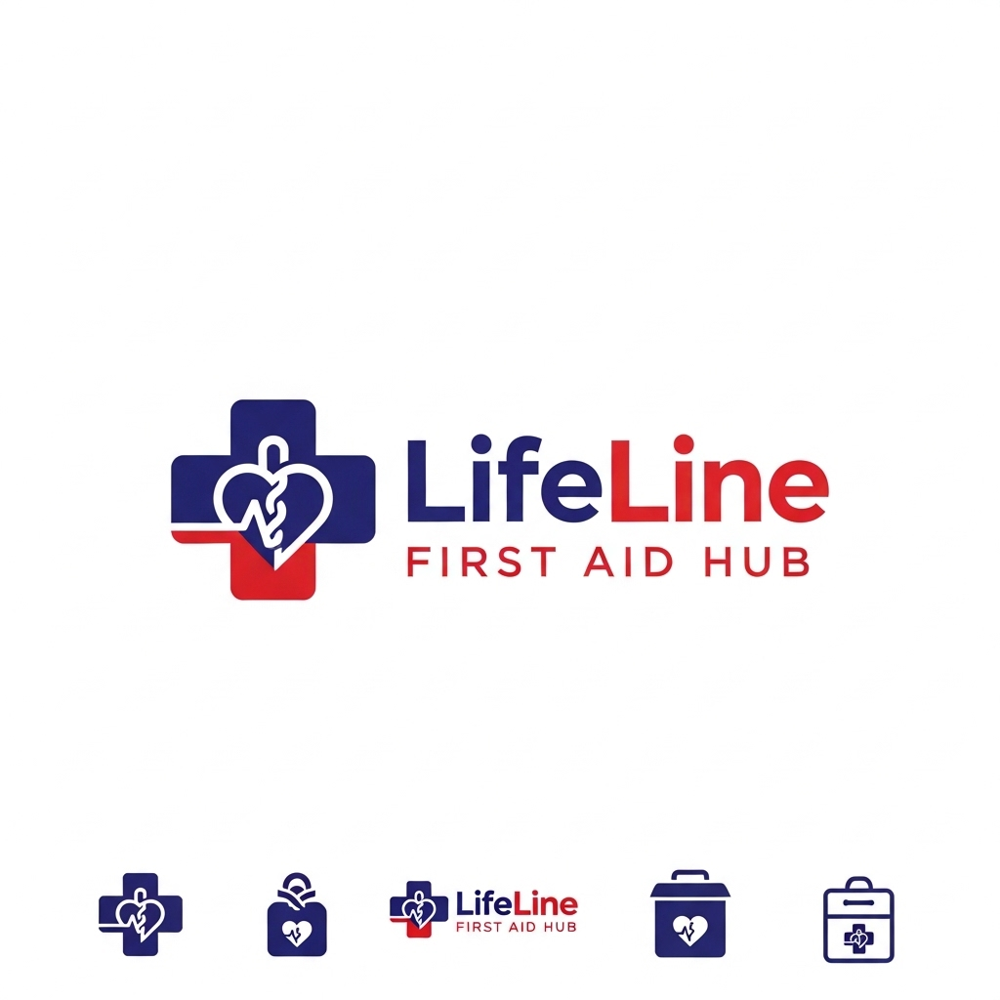

## LifeLine First Aid Hub

Empowering communities with life‑saving knowledge.

- **Stack**: HTML, CSS, JavaScript (no frameworks)
- **Focus**: accessibility, responsive UI, clean UX, and small but real interactions

### Why this project

I built LifeLine as part my CodePath WEB101 course project to practice front‑end fundamentals the right way: semantic HTML, strong visual hierarchy, responsible motion, and DOM-driven features that feel useful—not flashy. The app acts as a lightweight hub for first‑aid learning: quick links, visual guides, an RSVP flow with validation, dark mode, and an accessible success modal.

### Quick links

- **Live demo**: [Link](https://olive-dabbling-plane-952.vscodeedu.app)

---

## Features

- **Dark mode**: One‑click theme toggle backed by CSS variables. Persistently styled across headings, blocks, nav, footer, and components.
- **Reduce motion**: Respect users who prefer low animation. A toggle disables modal image motion to limit distraction.
- **Responsive layout**: Flexbox + media queries for mobile and desktop. Cards, navbar, timeline, and video blocks stack and scale cleanly.
- **RSVP flow with validation**:
  - Validates inputs (name, email, state) with clear inline error styles
  - On success, updates participant list/count and opens a personalized success modal
- **Success modal**: Time‑boxed, dismissible, and accessible. Clear feedback with subtle motion that can be disabled.
- **Curated training resources**: Clean, tappable cards linking to CPR and first‑aid videos with visual thumbnails.
- **Helpful footer + external resources**: Quick links to Red Cross and WHO guidance.





## Architecture at a glance

- `index.html`: Semantic sections (navbar, header, about, timeline, RSVP, resources, footer). Clean anchors for in‑page nav.
- `styles.css`: Design tokens via CSS variables; componentized rules for header/about/timeline/video blocks/RSVP/modal; responsive breakpoints at 768px; full dark‑mode theme.
- `index.js`:
  - Theme toggle (`dark-mode` class on `body`)
  - RSVP form validation + DOM updates
  - Personalized success modal with timed close
  - “Reduce Motion” toggle that gates animations


## Getting started (local)

1. Clone this repo
2. Open `index.html` directly in your browser, or use a lightweight server (e.g., VS Code Live Server)

That’s it—no build step.


## Deploy

- **GitHub Pages**: push `main` → Settings → Pages → Deploy from branch → root → Save
- **Netlify/Vercel**: import repo, set root to project folder, deploy


## Implementation details

- **Design tokens**: Color palette, error colors, and themes managed under `:root` in `styles.css`. Easy to retheme.
- **Dark mode**: Global class toggle alters colors across components. Hover, borders, and shadows are re‑tuned for legibility.
- **RSVP + validation**: Basic length checks and email sanity check. Error state uses high‑contrast borders and soft background.
- **Success modal**: Focused feedback with a 5‑second auto‑dismiss and manual close button. Subtle rotation animation is gated by the Reduce Motion toggle.
- **Performance**: No heavy frameworks; just modern CSS and a few event listeners. Snappy on low‑power devices.


## Accessibility notes

- Dark mode with high‑contrast accents
- Clear focus and hover states on interactive elements
- Motion can be disabled by the user
- Semantic HTML structure for headings and sections


## Roadmap

- Add first‑aid topic pages with step‑by‑step flows and offline PDFs
- Expand to a PWA for low‑connectivity environments
- Multilingual support (EN + local languages)
- “Save for later” collections and shareable checklists


## Project structure

```
LifeLine FirstAid Hub/
  index.html
  styles.css
  index.js
  img/
    logo.png
    Emergency.png
    timeline.jpeg
```


## What I focused on

- Clean, readable code that another engineer can pick up fast
- Visual hierarchy and spacing that scales from phone to desktop
- Guardrails for users (validation, feedback, sensible defaults)
- Thoughtful motion that enhances, never distracts


## What I learned

- Balancing aesthetics and accessibility using CSS variables and dark‑mode theming
- Writing small, explicit DOM updates that are easy to reason about and test
- Building responsive layouts with flexible containers that don’t fight content
- Introducing motion in a way that respects user control (reduce‑motion)


## Contact

If you’d like to chat about this project:

- [Email](youngeabraham99@outlook.com)
- [LinkedIn](https://www.linkedin.com/in/abraham-yarba)


## Acknowledgments

- Built as my CodePath WEB101 Project
- Red Cross and WHO resources linked for learning


